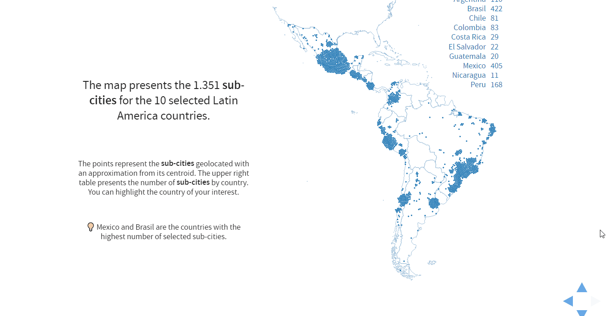

# Built Environment Profiles for Latin American Urban Settings

This is the final project of the [Visual Analytics course](http://johnguerra.co/classes/isis_4822_fall_2018/) in [Universidad de los Andes](http://www.uniandes.edu.co/).

## Project Description

Salud Urbana en América Latina ([SALURBAL](https://drexel.edu/lac/salurbal/overview/)), is a five-year project launched in April 2017. The Drexel University Dornsife School of Public Health and partners throughout Latin America and in the United States are working together to study how urban environments and urban policies impact the health of city residents throughout Latin America.

More specifically, it is addressed in this sudy: **How to quantify the contributions of city-level Built Environment (BE) factors to differences in levels of health and health inequalities within and between cities?**

The BE significantly affects the public’s health. For more than a decade there has been an increase in the collaborations among public health, social sciences and urban planning researchers to study how the BE may impact health and health inequities. Several features of Latin American cities (LAC) make them uniquely suited for the study of their urban environment. One approach to managing the complexity and volume of the data describing the urban settings and environmental characteristics of LAC is to develop BE profiles for cities and sub-cities. These profiles are helpful because they help to understand how multiple dimensions of the BE come together in like cities.

## User Abstraction

The tool developed intend to serve as decision-making support mechanism in the contexts of town planning and public health. This fact does not imply that the tool cannot be used by an user without previous experience in these fields of knowledge. In this sense, two kind of users are defined: domain expert user and data analytics user.

A domain expert user is a researcher or practitioner working on fields such as urban planning or public health and may not have experience in data analytics. In general terms, the development of this tool pretend to have impact on policy-making contexts, where domain expert users have certain level of understanding of the problem and its implications, but do not have enough methodological approaches to achieve a better understanding and solution design of the problem.

A data analytics user is one with some experience and skills in topics such as information visualization, statistics, machine learning, among others, and may not have knowledge in the context of the data. Generally, a data analytics user could use this research as informative work to improve or develop more tools related to research in urban planning and urban health fields. 

## Data Abstraction

Distinct aspects from BE and urban policies are considered. For this purpose, a set of socio-demographic, built environment, transport systems, among other attributes are available for LAC with more than 100.000 inhabitants. For each attribute category, three analysis levels can be performed, as described in Figure \ref{fig:citylevels}. The first or administrative level (L1Admin) corresponds to the political-administrative boundary defined by governmental entities. The L1Admin level is the greatest analysis level and shows the dynamic of whole city. The second level (L2) corresponds to administrative subdivisions defined by each entity and represents the analysis level for the dynamics inside the city. The last level (L3) details neighborhoods as the most granular level of analysis. This third level is not finally considered because of availability of data for all units. The attributes are builded from satellite images and shape files. With this in mind, L1UrbExt analysis level is proposed consisting of the apparent extension of the urban boundary that is defined by zones where there are human settlements. The total amount of units for L1Admin and L1UrbExt is 371 cities and 1.432 sub-cities for L2, around 11 Latin-American countries. This information is provided by SALURBAL in **Table** format taken in an instant time (**Static**) where an **Item** corresponds to a geographical unit (city of sub-city previously defined), so additional derivation activities are not required.

For each analysis level, three domains are specified to characterize the BE: urban landscape (12 attributes), street design (15 attributes) and transport systems (20 attributes). For urban landscape attributes, a patch as the minimum analysis unit is defined and corresponds to a grid of 100x100 pixels. This attributes measure the shape, fragmentation and isolation level by unit patches, in a normalized way. The street design attributes measure aspects related to density and shape of track network by unit. For both domains the attribute type is **Quantitative Sequential**. Finally, transport system attributes indicate the presence of sustainable transport systems such as BRT, subway and bicycle in addition to phenomena as congestion and air quality. The presence of some of the sustainable transport systems is a **Categorical** attribute.

Position attributes (latitude and longitude) of type **Quantitative Diverging** for each unit are provided, so dataset type also can be considered as **Geometry**. In addition, BE profiles are identified by clustering algorithms by the SALURBAL team, being this is a **Categorical** attribute.
 
## Task Abstraction

Tasks described below are the result of multiple meetings with the SALURBAL team:
 
 - **T1:** Characterize the profiles previously identified. This profiles must be explained in terms of attributes considered during modeling stage, so users need to **Compare** the **Distribution** of different attributes among profiles. 

 - **T2:** For itself, the profiles are not meaningful at least that were related with some demographic or health outcome. Users need to **Compare** the **Distribution** of demographic or health outcomes among profiles.

 - **T3:** Users outside SALURBAL context need to identify how many cities or sub-cities from his country are included in the project. In other terms, users need to **Lookup** **Features** of a specific city or sub-city included in the analysis.

 - **T4:** The motivation to perform clustering methods to find profiles for Latin Amercian cities and sub-cities is not clear for many experts. So it is important to show users the variability among cities and sub-cities in the specified domain. Users need to **Compare** the **Distribution** of different attributes for each country.

 - **T5:** Many cities have highest values for some attributes. Users need to **Identify** cities and sub-cities with **Extreme** values for some BE attributes.

 - **T6:** As an extension of Task 1, users need to **Compare** two specific attributes and validate the **Correlation** between them for each profile. Many attributes are highly correlated, so experts need to focus in less attributes to make their analysis.

 - **T7:** Select groups of units by a specific demographic or health outcome. Expert users can be interested in **Browse** or **Identify** cities or sub-cities with **Extreme** values for the outcome. 

 - **T8:** Users need to see the identified cluster for his countries of interest and see the relation with specific demographic or health outcomes. For users, public policies could be developed based on specific results countries. Users need to **Browse** the cities or sub-cities of a specific country and **Compare** their **Similarity** in terms of demographic or health outcomes and the relation among the profile.
 
## Proposed Solution

  <a href="https://fabiancpl.github.io/salurbal/">Demo</a> |
  <a href="https://docs.google.com/presentation/d/19TM8mUnwzEZCaLqs_d_lis9ooL8bb3x6oT5Vmpbhcec/edit?usp=sharing">Slides</a> |
  <a href="https://fabiancpl.github.io/salurbal/docs/paper.pdf">Paper</a>

## Authors

[Fabian C. Peña](https://fabiancpl.github.io) - Systems and Computing Engineering Department
 
Andres F. Useche - Industrial Engineering Department
 
Universidad de los Andes - Bogota, Colombia